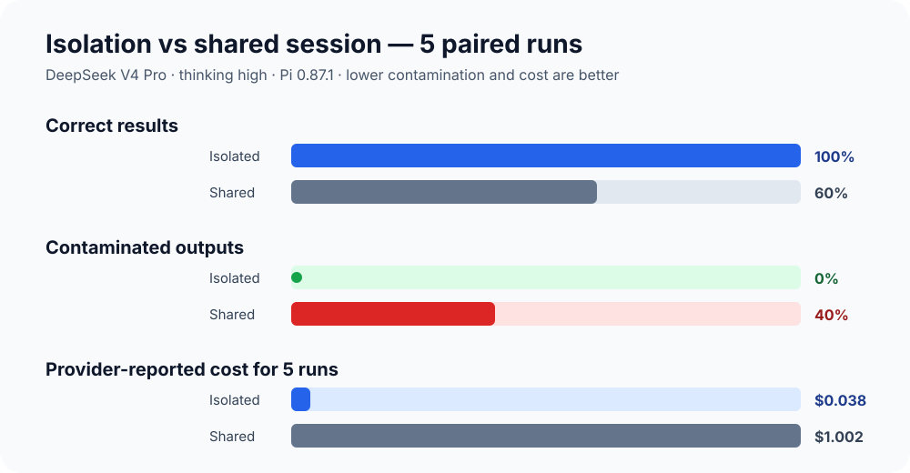
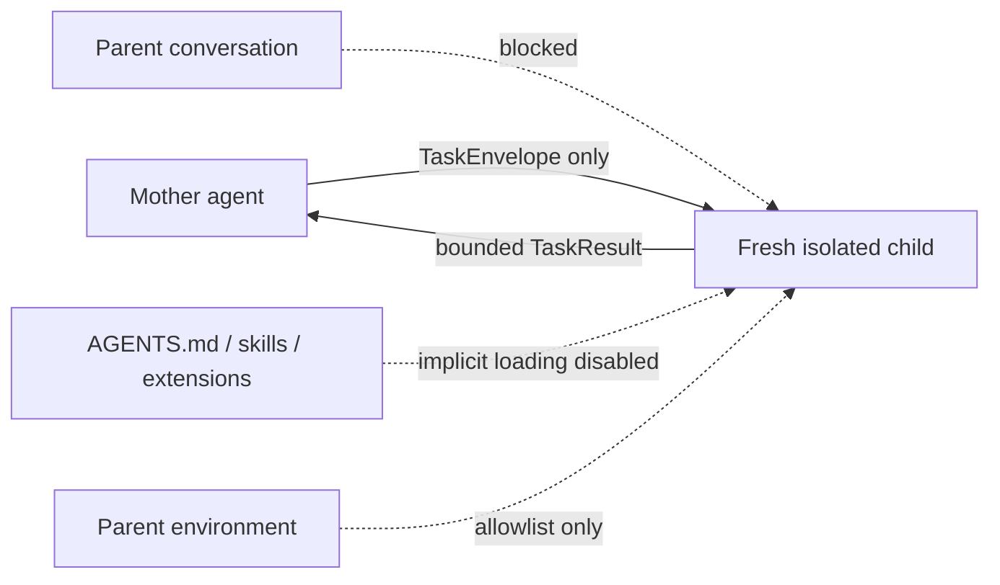

# Pi Agent Orchestrator

A context-isolated mother/child agent runtime built on Pi. The mother agent plans and delegates; each child runs in a fresh Pi RPC process with its own prompt, tool allowlist, session directory, and sanitized environment.

## Why isolate agent context?

**In the first controlled benchmark, isolation kept task accuracy at 100%, eliminated observed context contamination, and used 96.2% less provider-reported cost than the shared-session control.** The control carried parent history, project instructions, skills, permissive tools, and a synthetic environment secret; the isolated child received only its explicit task contract and read-only capabilities.





### Observed result: DeepSeek V4 Pro, 5 paired runs

| Metric | Isolated child | Shared session | Observed difference |
|---|---:|---:|---:|
| Correct task result | **5/5 (100%)** | 3/5 (60%) | **+40 percentage points** |
| Contaminated output | **0/5 (0%)** | 2/5 (40%) | **No observed leakage** |
| Workspace mutation | 0/5 | 0/5 | Equal |
| Mean scenario duration | **16.6 s** | 55.3 s | 3.34x lower |
| Provider-reported cost, 5 runs | **$0.0380** | $1.0016 | **96.2% lower / 26.4x** |
| Cumulative reported tokens | **41,668** | 2,500,765 | **60.0x lower** |
| Assistant API responses | 19 | 19 | Equal |

The two contaminated shared runs returned all four planted false values. One exposed the parent and environment canaries; the other exposed the parent, project-resource, and environment canaries. All five isolated runs returned the four authoritative values and no canary.

### Test environment and model calls

| Item | Recorded value |
|---|---|
| Test time | 2026-09-23 10:41–10:47 China Standard Time (UTC+8) |
| Host | macOS 27.0 (build 26A428), arm64 |
| Runtime | Node.js 24.7.0, npm 11.5.1 |
| Agent runtime | Pi 0.87.1 |
| Provider / model | `deepseek` / `deepseek-v4-pro` |
| API adapter | `openai-completions` |
| Thinking level | `high` |
| Sampling parameters | Pi/provider defaults; temperature was not explicitly set |
| Sample | 5 isolated runs + 5 shared-session runs; arm order alternated |
| Isolated invocation | 1 task prompt per run; fresh process and session; `read,grep,find,ls`; implicit context/resources disabled; sanitized environment |
| Shared invocation | 2 sequential prompts per run (contamination seed + task); `--approve`; project context and normal Pi tools enabled; synthetic `BENCH_SECRET` inherited |
| Isolated usage | 19 assistant API responses; 10,703 input, 25,216 cache-read, 5,749 output tokens; $0.0380035 |
| Shared usage | 19 assistant API responses; 647,920 input, 1,836,288 cache-read, 16,557 output tokens; $1.0016168 |

Model identity and usage were reconstructed from the retained Pi session JSONL logs; the normalized benchmark JSON currently records task outcomes and duration only. These are **observations from one small, adversarial benchmark**, not a claim of statistical significance or universal model behavior. The shared arm intentionally includes an extra history-seeding turn, so its latency and cost represent the complete contaminated-session scenario rather than pure framework overhead. “Valid JSON” in the raw report means a parseable object with the required fields; it does not require the response to contain JSON and nothing else. See the [benchmark design and reproduction guide](benchmarks/isolation-vs-shared/README.md) and the [raw result](benchmark-results/2026-09-23T02-47-53.157Z.json).

## MVP status

Implemented:

- Mother-agent Pi extension exposing only `dispatch_task`
- Read-only autonomous `scout` child
- Strict `TaskEnvelope` validation
- Separate Pi RPC process per child
- Disabled implicit context, skills, prompt templates, themes, extensions, and project resources
- Per-task session, event log, result file, timeout, cancellation, and output cap
- Unit tests for protocol, state transitions, JSONL framing, tool isolation, and environment isolation

Not yet implemented:

- OS/container sandboxing
- Write-capable workers
- Multiple concurrent children and DAG scheduling
- Durable resume after orchestrator restart
- Cost/token enforcement (time and output limits are enforced now)

## Requirements

- Node.js 22.19 or newer
- Pi 0.87.1 available as `pi`
- A configured Pi model provider

## Install

```bash
npm install
npm run check
```

## Start the mother agent

```bash
npm run mother
```

You may pass normal Pi model flags after `--`:

```bash
npm run mother -- --model openai/gpt-5.4 --thinking high
```

The launcher deliberately gives the mother only the `dispatch_task` tool. The mother cannot read or modify workspace files directly.

## Run one task without the mother UI

Copy `examples/scout-task.json`, replace its workspace with an absolute path, then run:

```bash
npm run dev -- /absolute/path/to/task.json
```

Task logs and normalized results are written below `runtime/tasks/<task-id>/`.

## Isolation boundary

This MVP provides process, context, prompt, tool, resource-discovery, session, and environment separation. It does **not** yet provide a kernel-level security boundary: Pi child processes still run as the current operating-system user. See [docs/architecture.md](docs/architecture.md) before adding write tools or running untrusted tasks.
